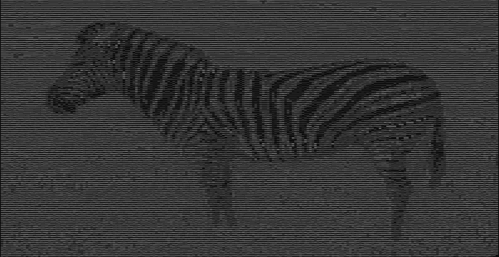

# ASCII Art

A project that turns photos into ASCII art. Inspired by [this blog post](https://robertheaton.com/2018/06/12/programming-projects-for-advanced-beginners-ascii-art/).

Photos from [Unsplash](https://unsplash.com/).

&nbsp;


## Run this project

1. Make sure you have Python installed

2. Install Pillow
```
pip install pillow
```
3. Run `main.py`
```
python main.py
```

Make sure the photos that you want to use are in the same folder as `main.py`. You'll have to zoom out in your terminal to view the image properly.
